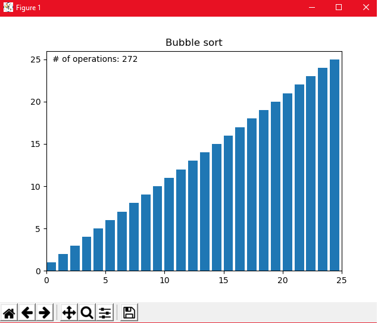
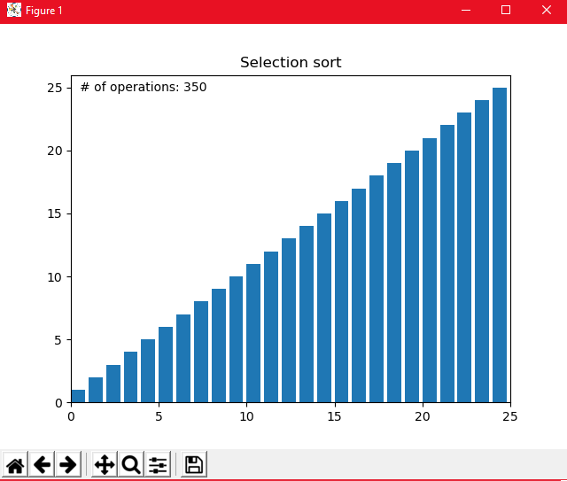

### Enhancement Two: Data Structures & Algorithms

This artifact is a collection of 5 sorting algorithms - Bubble, Insertion, Merge, Quick, and Selection.

In Computer Science, a sorting algorithm is an algorithm that places elements from a list in a certain order.
When first learning about sorting algorithms in this program I could understand the need for them, but I lacked understanding the greater overall picture of what efficient sorting algorithms are providing. Efficient sorting is important for optimizing the efficiency of other algorithms (i.e., search) that require the input data to be sorted. When dealing with small amounts of data, the algorithms are almost trivial, in that, it doesn't really matter which you use given a small enough input size. But as the size of the input data grows, it quickly becomes obvious that some sorting algorithms outperform others and the concept of Big O notation comes into play. Big O notation is the language used to express the length of time an algorithm takes to run, it's a way to compare the efficiency of different approaches to a problem.

The artifact started out with only bubble and merge, as a personal project, to try to gain an understanding on how different algorithms were working under-the-hood and performed in sorting data. What I think helps the most in this is the visual component provided by the matplotlib library. Matplotlib is a library for creating static, animated, and interactive visualizations in Python. There are a lot of concepts in Computer Science that can be difficult to wrap your head around due to their somewhat abstract nature and I think using visualization as a tool to mediate that gap is extremely helpful. In working on and creating this aspect of the project, I was able to gain deeper insight into how some of these particular algorithms were working on a very practical level. The visualization also helped by providing context to what was going on while I was waiting on a particular algorithm to run.

Ultimately, I would like to incorporate the visualizations of these algorithms into the web server I am standing up in the third portion of my project, rather than as standalone code, to serve as an additional component of the overall front-end GUI. I would also like to be able to integrate the data being stored in the database to run through these sorting algorithms, rather than using arbitrary random sampling, which is used to demonstrate the concepts.

Below shows a screenshot of the sorting algorithms (Bubble vs Selection)
Sorting through an array of 25 random integers to demonstrate the number of operations each takes to fully sort.

[Enhancement Two Files](/Enhancement%20Two)

[Back To Main](index.md)
