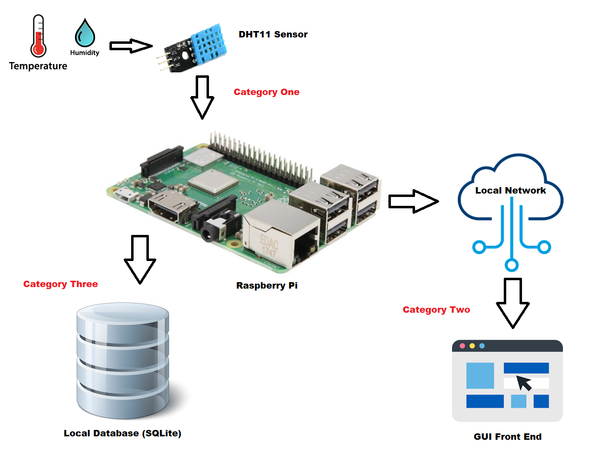

I took an open-source personal project and combined it with knowledge learned over the course of my time here at SNHU to demonstrate skills I've learned
that span Software Engineering and Design, Algorithms, and Database systems. The personal project I've built some time ago utilizes a Raspberry Pi and DHT11 sensor.
The DHT11 is a basic, low-cost digital temperature and humidity sensor. It uses a capacitive humidity sensor and a thermistor to measure the surrounding air, and outputs a digital signal on the data pin.

My goal is to automate the collection of this sensor data and rather than print values to the screen - I will insert the collected data into a SQLite database that will live on the RPi. This will integrate into the Category Three Databases enhancement.

Skills that will be illustrated and outcomes these skills align to include demonstrating the ability to program solutions to solve problems of logic and implement them in software while also demonstrating the ability to create industry-standard designs using robust and efficient code to deliver value and accomplish industry-specific goals.

For the category of Algorithms and Data Structures, I would like to utilize the data that I've been collecting from Category One and apply some of the concepts from CS 260: Data Structures and Algorithms to compare the efficiency of different sorting algorithms given multiple data input sizes.
My goal in Category Two will be to take the data that I've collected during the Category One phase and implement different sorting algorithms utilizing visualization libraries in Python. I will utilize a simple sorting demonstration using Bubble Sort vs Quick Sort to convey how efficiency is impacted as the dataset grows.
Skills that will be illustrated and outcomes these skills align to include using well-founded and innovative techniques, skills, and tools in computing practices as well as addressing potential design flaws in software architecture during the requirements phase by measuring expected efficiency before implementing code.

The Databases portion of the project will build from the knowledge learned in DAD 220: Introduction to SQL and CS 340: Advanced Programming Concepts.
I will utilize a SQLite Database on the Raspberry Pi that will be the storage and collection point for the data.
I will also build a local web-server with Python and Flask on the Pi that will interact with this database providing a front-end GUI for users to more easily view and interact with the collected data.

Skills and outcomes I plan to illustrate in the code review include existing functionality where I will discuss what the code is, identify what it does, and how it works. I will review the code structure, while being aware of efficiencies, and making certain to comment and document my process, while finding areas I can improve.
Skills and outcomes I plan to illustrate in the narratives include gaining better understanding in the overall software development life cycle through requirements analysis and overall project goals. I also plan to illustrate how security fits into the overall narrative of the project by addressing potential design flaws in software architecture and defining an approach that ensures all data is explicitly validated.
Skills and outcomes I plan to illustrate in the professional self-assessment include demonstrating the ability to use the software development life cycle to create realistic production schedules for software projects.

